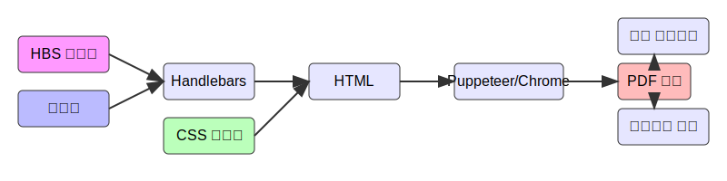

# @woojoo/pdf

NestJS 기반의 PDF 생성 모듈입니다. Handlebars 템플릿을 PDF로 변환할 수 있습니다.

## 동작 프로세스

PDF 생성 프로세스는 다음과 같은 단계로 진행됩니다:



1. **입력**
   - HBS 템플릿: Handlebars 문법으로 작성된 템플릿 파일
   - 데이터: 템플릿에 주입될 JSON 데이터
   - CSS 스타일: PDF 스타일링을 위한 CSS

2. **처리**
   - Handlebars 엔진이 템플릿과 데이터를 결합하여 HTML 생성
   - 생성된 HTML에 CSS 스타일 적용
   - Puppeteer가 Chrome을 통해 HTML을 PDF로 변환

3. **출력**
   - PDF 버퍼 생성
   - 파일 다운로드 또는 브라우저에서 직접 보기 가능

## 설치

```bash
npm install @woojoo/pdf
```

## 필수 요구사항

이 모듈은 Puppeteer를 사용하여 PDF를 생성하기 때문에 Chrome 브라우저가 필요합니다.

### Chrome 설치 방법

#### 1. Puppeteer를 통한 자동 설치 (권장)
```bash
# npm을 사용하는 경우
npx puppeteer browsers install chrome

# pnpm을 사용하는 경우
pnpm dlx puppeteer browsers install chrome

# yarn을 사용하는 경우
yarn dlx puppeteer browsers install chrome
```

#### 2. 수동 설치

각 운영체제별 Chrome 설치 방법:

**macOS:**
```bash
# Homebrew를 통한 설치
brew install --cask google-chrome
```

**Ubuntu/Debian:**
```bash
# apt를 통한 설치
wget https://dl.google.com/linux/direct/google-chrome-stable_current_amd64.deb
sudo dpkg -i google-chrome-stable_current_amd64.deb
sudo apt-get install -f
```

**CentOS/RHEL:**
```bash
# yum을 통한 설치
sudo yum install chromium chromium-headless chromium-libs chromedriver
```

**Windows:**
1. [Chrome 공식 웹사이트](https://www.google.com/chrome/)에서 설치 파일 다운로드
2. 다운로드한 설치 파일 실행

## 사용 방법

### 모듈 설정
```typescript
import { Module } from '@nestjs/common';
import { PdfModule } from '@woojoo/pdf';

@Module({
  imports: [PdfModule],
})
export class AppModule {}
```

### PDF 생성 예제

```typescript
import { Injectable } from '@nestjs/common';
import { PdfService } from '@woojoo/pdf';
import { Response } from 'express';

@Injectable()
export class YourService {
  constructor(private readonly pdfService: PdfService) {}

  async generatePdf(res: Response) {
    // HBS 템플릿 준비
    const template = `
      <html>
        <head>
          <meta charset="UTF-8">
          <style>
            body { font-family: Arial, sans-serif; }
          </style>
        </head>
        <body>
          <h1>{{title}}</h1>
          <p>{{content}}</p>
        </body>
      </html>
    `;

    // PDF 생성
    const pdfBuffer = await this.pdfService.hbsToPdf({
      template,
      data: {
        title: '제목',
        content: '내용',
      },
      options: {
        format: 'A4',
        margin: {
          top: '20mm',
          right: '20mm',
          bottom: '20mm',
          left: '20mm',
        },
      },
    });

    // PDF 파일 다운로드
    await this.pdfService.sendPdfResponse(res, 'document.pdf', pdfBuffer);

    // 또는 브라우저에서 열기
    await this.pdfService.sendPdfResponse(res, 'document.pdf', pdfBuffer, { 
      inline: true 
    });
  }
}
```

## API 문서

### PdfService

#### hbsToPdf(options: HbsToPdfOptions): Promise<Buffer>

Handlebars 템플릿을 PDF로 변환합니다.

**매개변수:**
- `options: HbsToPdfOptions`
  - `template: string` - Handlebars 템플릿 문자열
  - `data?: Record<string, any>` - 템플릿에 주입할 데이터
  - `options?: PdfOptions` - PDF 생성 옵션
  - `styles?: string` - CSS 스타일

**반환값:**
- `Promise<Buffer>` - 생성된 PDF의 버퍼

#### sendPdfResponse(res: Response, filename: string, buffer: Buffer, options?: PdfResponseOptions): Promise<void>

PDF 버퍼를 HTTP 응답으로 전송합니다.

**매개변수:**
- `res: Response` - Express Response 객체
- `filename: string` - 다운로드될 파일 이름
- `buffer: Buffer` - PDF 버퍼
- `options?: PdfResponseOptions`
  - `inline?: boolean` - 브라우저에서 열기 여부 (기본값: false)
  - `charset?: string` - 파일명 인코딩 (기본값: UTF-8)

### 인터페이스

```typescript
interface PdfOptions {
  format?: 'A4' | 'A3' | 'Letter' | 'Legal' | 'Tabloid';
  landscape?: boolean;
  margin?: {
    top?: string;
    right?: string;
    bottom?: string;
    left?: string;
  };
  printBackground?: boolean;
  scale?: number;
  width?: string | number;
  height?: string | number;
}

interface HbsToPdfOptions {
  template: string;  // Handlebars 템플릿 문자열
  data?: Record<string, any>;  // 템플릿에 주입할 데이터
  options?: PdfOptions;  // PDF 생성 옵션
  styles?: string;  // CSS 스타일
}

interface PdfResponseOptions {
  inline?: boolean;  // true면 브라우저에서 열기, false면 다운로드
  charset?: string;  // 파일명 인코딩
}
```

## 라이선스

MIT 